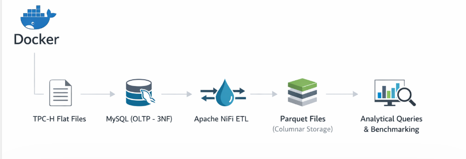
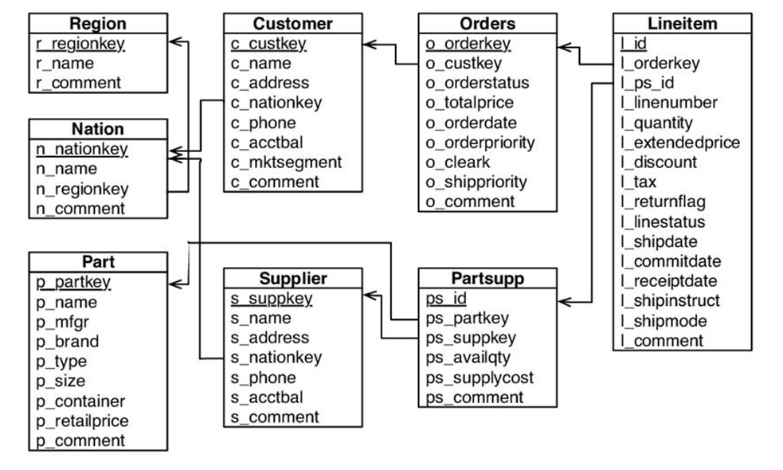
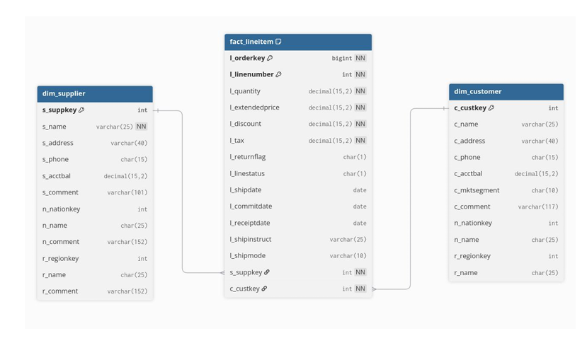
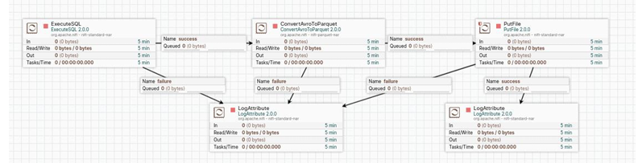
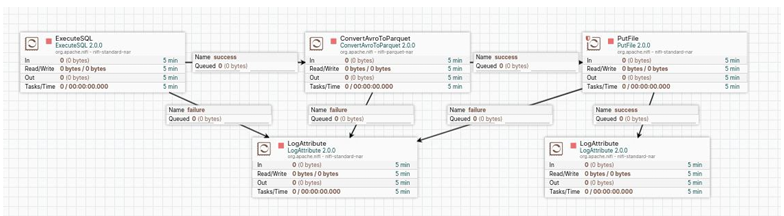
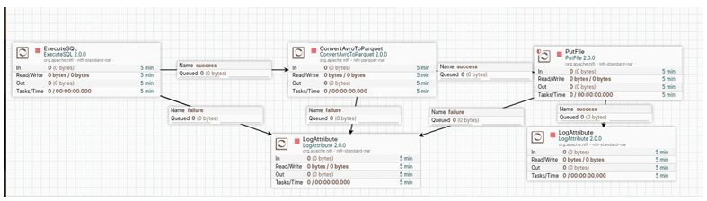
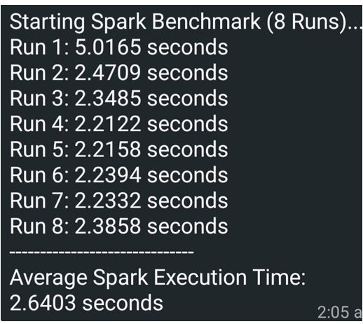

# TPC‑H OLAP Pipeline with Apache NiFi

An end‑to‑end **OLAP data pipeline** that transforms the TPC‑H benchmark dataset
from a normalized OLTP schema into an analytics‑optimized **Star Schema**
using Apache NiFi and columnar Parquet storage.

---

## Project Context

This project was developed as part of the **Designing Data‑Intensive Applications (DDIA)** course
to demonstrate practical differences between **OLTP** and **OLAP** systems through
real data modeling, ETL design, and performance benchmarking.

Rather than focusing on application‑level logic, the project emphasizes:
- Analytical data modeling  
- Batch‑oriented ETL pipelines  
- Query performance improvements for large‑scale datasets  

---

## High‑Level Architecture


```
TPC‑H Flat Files
↓
Dockerized MySQL (OLTP – 3NF)
↓
Apache NiFi ETL
↓
Parquet Files (Columnar Storage)
↓
Analytical Queries & Benchmarking
```

---

## Dataset

- **Source:** TPC‑H Benchmark
- **Scale Factor:** SF = 1
- **Largest Table:** `LINEITEM` (~6M rows)

TPC‑H provides a realistic, industry‑standard decision‑support workload
commonly used to evaluate analytical systems.

---

## OLTP Schema

- Fully normalized **3NF schema**
- 8 core entities:
  - REGION, NATION
  - PART, SUPPLIER
  - CUSTOMER, ORDERS
  - PARTSUPP, LINEITEM
- Optimized for transactional integrity, not analytical workloads

---

## OLAP Star Schema Design

### Fact Table
- **fact_lineitem**
  - Atomic sales and order‑line events
  - Measures: quantity, revenue, discount, tax

### Dimension Tables
- **dim_customer** (customer + nation + region)
- **dim_supplier** (supplier + geography)
- **dim_part** (product attributes)
- **dim_date** (derived time dimension)

This denormalized model enables efficient aggregation and scan‑heavy
analytical queries.

---

## Apache NiFi ETL Pipelines

### Pipeline 1 – `fact_lineitem`

- Batched extraction using `GenerateTableFetch`
- Order enrichment via parallel SQL joins
- Conversion to Parquet format
- Optimized for large fact volumes

### Pipeline 2 – `dim_supplier`

- Direct denormalization from OLTP schema
- Exported as columnar Parquet files

### Pipeline 3 – `dim_customer`

- Geographic enrichment
- Parquet output for analytical workloads

All pipelines use:
- JDBC connection pooling
- Avro → Parquet conversion
- Batch‑oriented processing semantics

---

## Performance Benchmarking

To evaluate OLTP vs. OLAP performance:
- **Query:** TPC‑H Query 1 (Pricing Summary Report)
- **Compared Systems:**
  - MySQL (normalized OLTP)
  - Analytical queries on Parquet output

### Results
- Significant reduction in execution time on OLAP‑optimized data
- Demonstrates clear benefits of:
  - Star schema modeling
  - Columnar storage
  - Batch analytical pipelines

---


## Technologies Used

- Apache NiFi
- MySQL (OLTP)
- Parquet
- Docker
- SQL (DDL & ETL)
- TPC‑H Benchmark Dataset

---

## Key Takeaways

- OLTP schemas are unsuitable for analytical workloads at scale
- Star schemas drastically improve query performance
- Apache NiFi provides an effective, visual ETL solution for batch pipelines
- Columnar formats are essential for OLAP systems

---

## Notes

This project focuses on **analytical data engineering principles** rather than
application‑level development or streaming systems.

---

## Author

**Abdelrhman Anwar**  
Data Engineer  

GitHub: https://github.com/Abdo-Anwar  
LinkedIn: https://www.linkedin.com/in/abdelrhman-anwar

---
